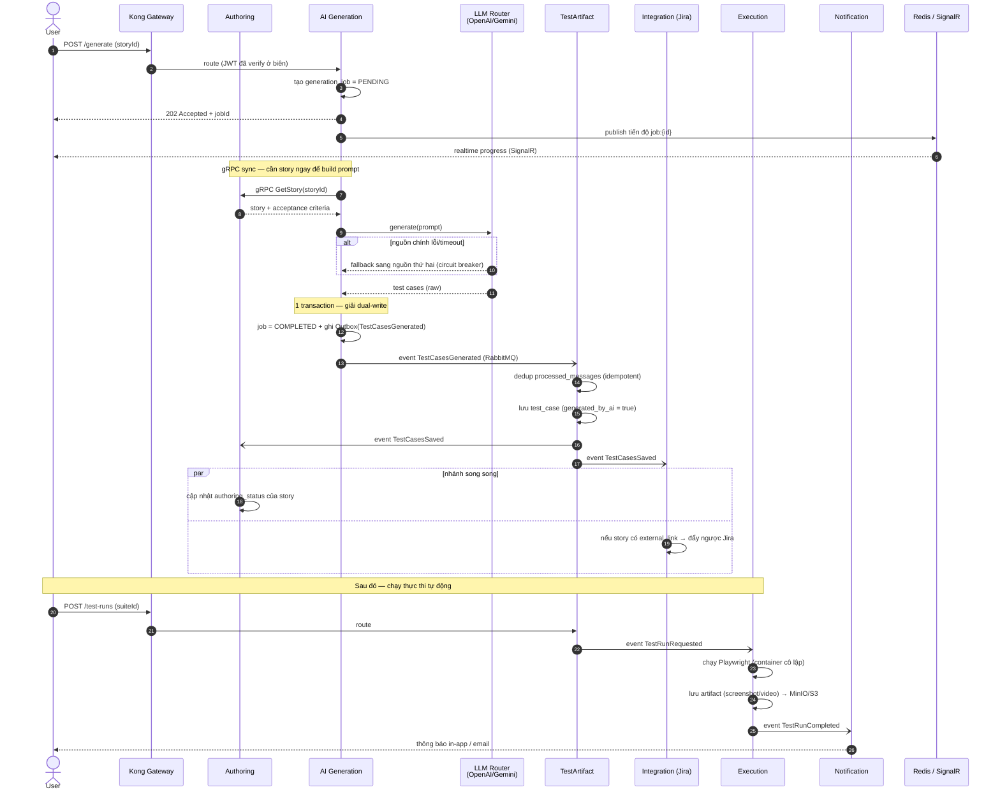

# Luồng xương sống — Generate Test Case (sequence diagram)

> Render: dán vào [mermaid.live](https://mermaid.live), hoặc xem trực tiếp trên GitHub (hỗ trợ Mermaid).
> Đây là luồng phức tạp nhất, hội tụ Saga · Outbox · gRPC · CQRS · Idempotency · SignalR.

## Pattern thể hiện trong luồng

| Bước | Pattern | Vì sao |
|---|---|---|
| 4-5 | **202 + Redis/SignalR** | Không bắt user chờ LLM; theo dõi async. |
| 7-8 | **gRPC (sync)** | Caller cần story ngay để build prompt — dùng tiết kiệm. |
| 9-10 | **Strategy + Circuit breaker** | Router LLM fallback nguồn thứ hai khi lỗi. |
| 12-13 | **Transactional Outbox** | Giải dual-write: cập nhật DB + phát event atomically. |
| 14-16 | **Idempotency** | `processed_messages` chống xử lý trùng (at-least-once delivery). |
| 18-20 | **Choreography + read-model** | Service tự phản ứng event, không gọi chéo DB. |
| 24-28 | **Async execution + object storage** | Worker cô lập, DB chỉ giữ đường dẫn artifact. |
