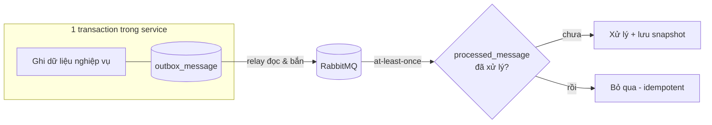
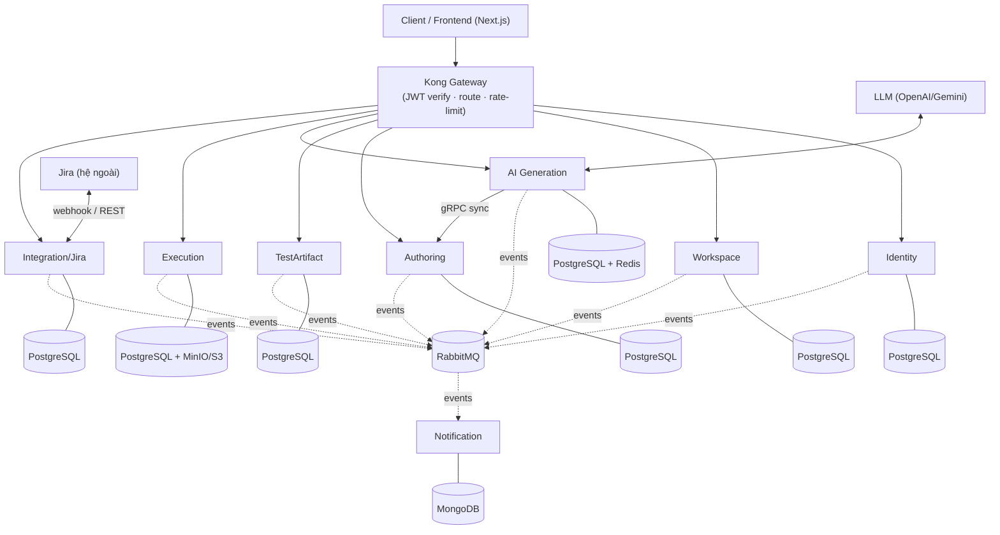
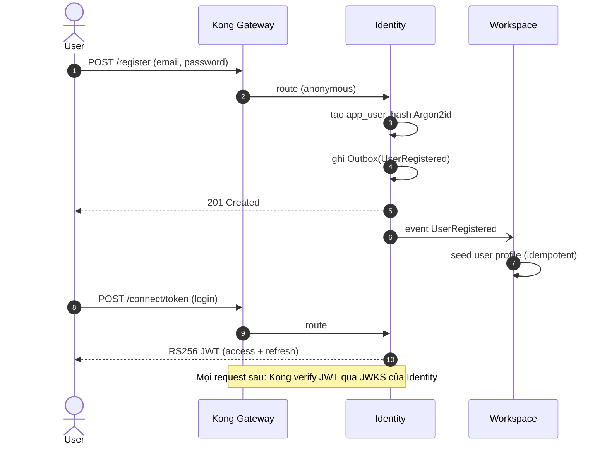
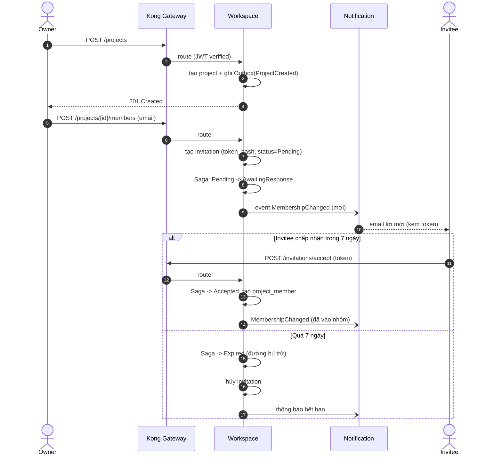
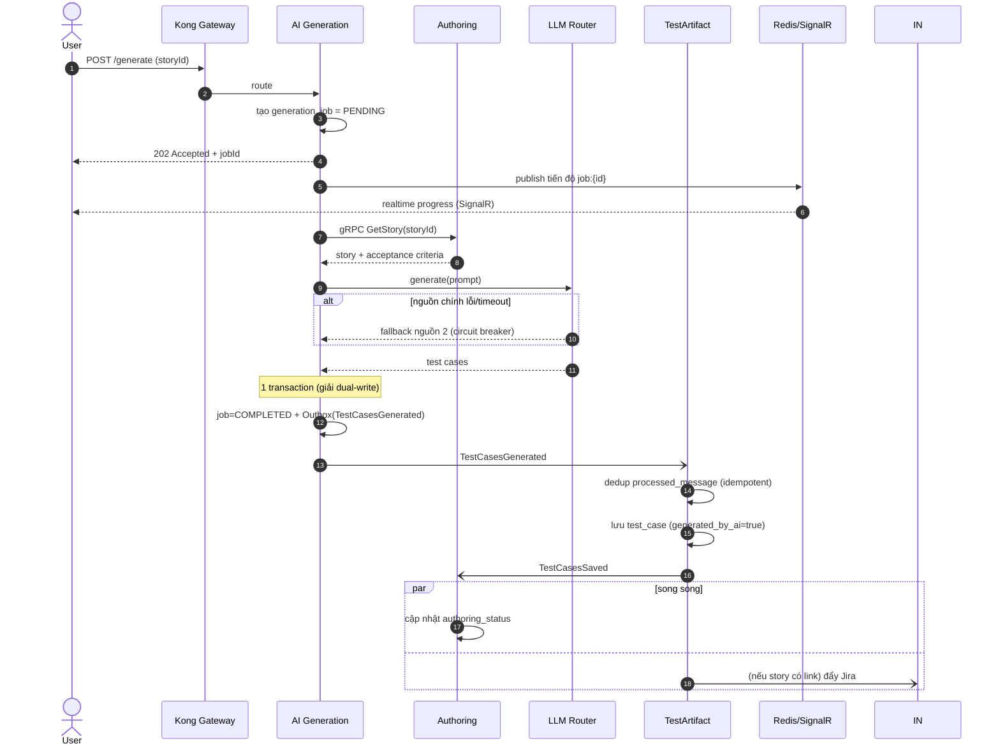
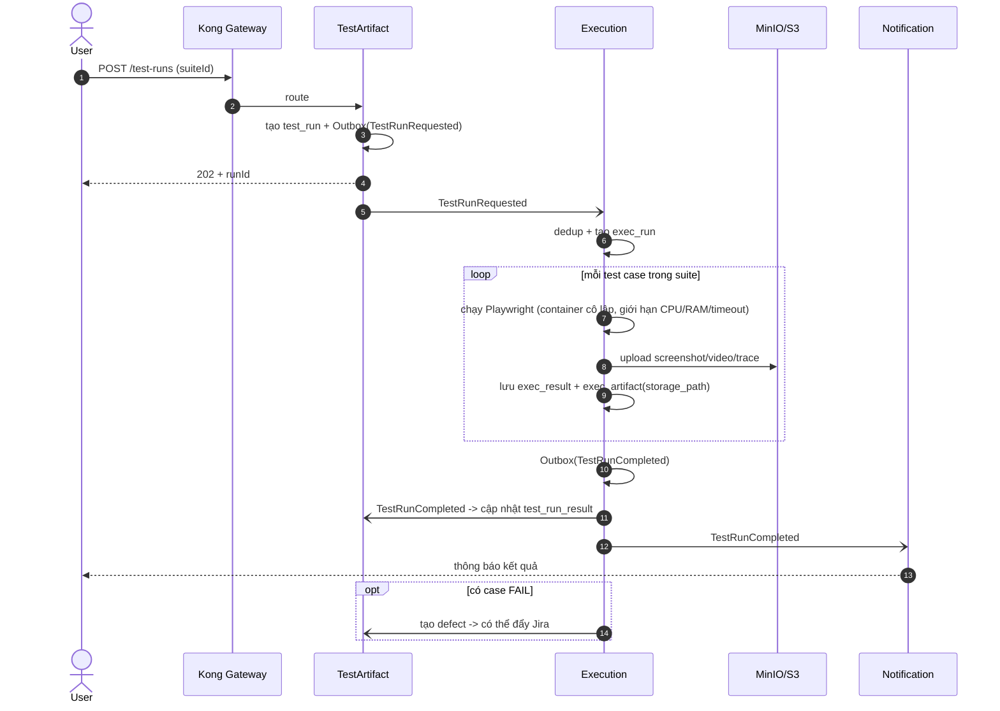
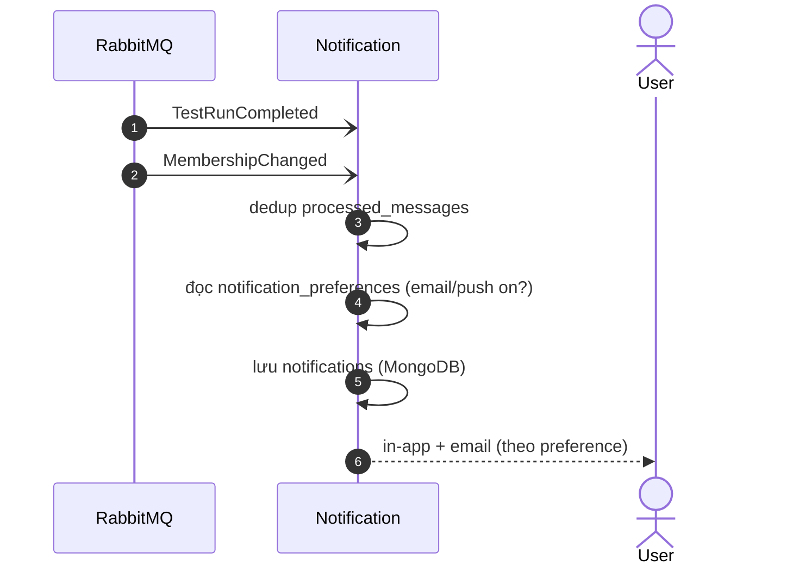
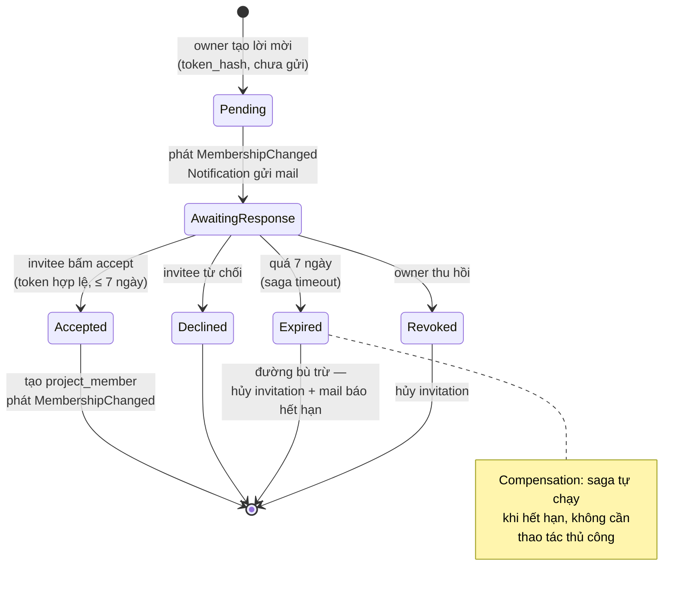
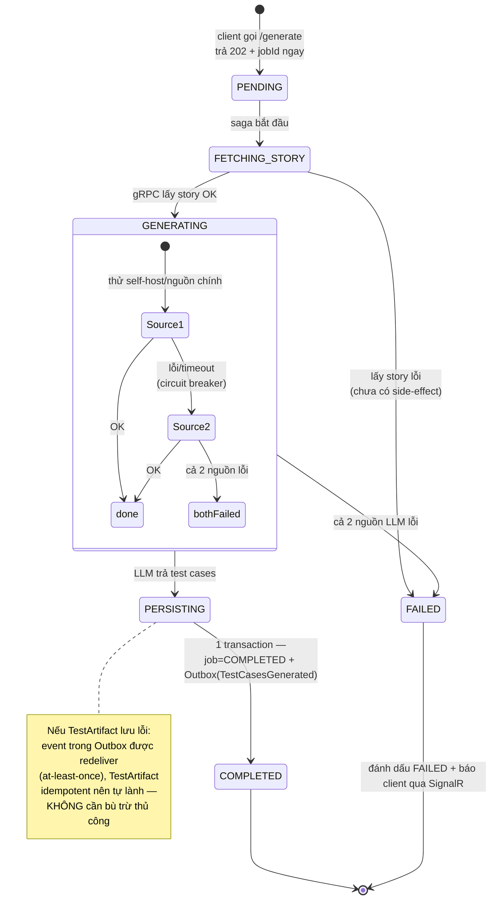

# QuraEx Backend — Giải thích Service & Luồng nghiệp vụ (tài liệu dạy team)

> Mục đích: tài liệu để lead trình bày cho cả nhóm hiểu **mỗi service làm gì · DB gánh nhiệm vụ gì · các luồng chạy ra sao**.
> Render Mermaid: xem trực tiếp trên GitHub, hoặc dán vào [mermaid.live](https://mermaid.live).
> Nguồn gốc: `docs/QuraEx_Architecture.md` (§4 luồng, §7 DB) + `docs/TASKS.md` (event contracts).

---

## 0. Cách đọc tài liệu này

Hệ thống = **8 microservice nghiệp vụ** + hạ tầng (Kong gateway, RabbitMQ, Redis). Mỗi service:
- **Sở hữu 1 DB riêng** — không service nào đọc DB service khác.
- **Giao tiếp 2 kiểu**: gRPC (đồng bộ, hiếm) + event qua RabbitMQ (bất đồng bộ, mặc định).
- **Tổ chức code giống nhau**: Vertical Slice + CQRS/MediatR + Clean Architecture.

### Mô hình tinh thần — 3 pattern lặp lại ở MỌI service (phải hiểu trước)

Trước khi đi vào từng service, team phải thấm 3 thứ — vì chúng giải thích **vì sao mọi DB đều có mấy bảng giống nhau**:

| Pattern | Bảng | Giải quyết vấn đề gì |
|---|---|---|
| **Transactional Outbox** | `*_outbox_message` | Khi vừa ghi DB vừa muốn phát event: nếu ghi DB xong mà gửi RabbitMQ lỗi (hoặc ngược lại) → lệch dữ liệu (*dual-write*). Giải: ghi event vào bảng outbox **trong cùng transaction với dữ liệu**, một relay đọc outbox bắn lên RabbitMQ sau. |
| **Idempotency** | `*_processed_message` | RabbitMQ giao *at-least-once* → 1 event có thể tới 2 lần. Giải: trước khi xử lý, check message_id đã có trong `processed_message` chưa; có rồi thì bỏ qua. |
| **Read-model / Snapshot** | `*_snapshot` | Service B cần dữ liệu của service A nhưng không được đọc DB A. Giải: A phát event, B lưu bản sao nhẹ (`membership_snapshot`, `story_snapshot`) và tự cập nhật từ event. |

---

## 1. Bản đồ hệ thống (system context)

**Đọc sơ đồ:** chỉ **Kong** lộ ra internet. Frontend luôn gọi qua Kong, không bao giờ gọi thẳng service. Service nói chuyện với nhau **chủ yếu qua RabbitMQ** (đường nét đứt), chỉ AI Gen → Authoring dùng gRPC (đường liền) vì cần trả lời ngay.

---

## 2. Từng service: vai trò · DB · event vào/ra

> Quy ước: **user_id ở mọi service là UUID tham chiếu**, KHÔNG phải khóa ngoại xuyên service.

### 2.1 Identity (PostgreSQL) — *"Bạn là ai"* (Authentication)
Quản lý danh tính: user, mật khẩu, JWT, OAuth, 2FA. Tự host OIDC bằng **OpenIddict**, phát RS256 JWT + JWKS để Kong và mọi service validate.

| Bảng | Nhiệm vụ |
|---|---|
| `app_user` | tài khoản: email (UK), `password_hash` (Argon2id), display_name, status |
| `refresh_token` | lưu **hash** token (không lưu thô), expires_at, revoked |
| `user_mfa` | secret 2FA, enabled |
| `openiddict_application/authorization/scope/token` | hạ tầng OIDC: client, grant, scope, token |
| `identity_outbox_message` | phát event ra ngoài |

- **Phát:** `UserRegistered`, `UserUpdated`
- **Nhận:** — (không phụ thuộc ai → vì vậy build đầu tiên)

### 2.2 Workspace (PostgreSQL) — *"Bạn được làm gì"* (Authorization)
Phân quyền **theo ngữ cảnh project**: workspace, project, membership, mời thành viên. Tách khỏi Identity vì quyền ở đây phụ thuộc dữ liệu membership.

| Bảng | Nhiệm vụ |
|---|---|
| `workspace` | không gian làm việc, type PERSONAL/TEAM, owner_user_id |
| `project` | dự án trong workspace, `project_key` (UK) |
| `workspace_member` | vai trò cấp workspace: OWNER/ADMIN/MEMBER |
| `project_member` | vai trò cấp project: EDITOR/VIEWER |
| `invitation` | lời mời theo project: email, `token_hash`, status, expires_at |
| `workspace_outbox_message` | phát event |

- **Phát:** `MembershipChanged`, `ProjectCreated`
- **Nhận:** `UserRegistered` (seed profile user)

### 2.3 Authoring (PostgreSQL) — Nguồn yêu cầu ✅ *service mẫu*
Quản lý user story + acceptance criteria + business rule. Là service tham chiếu để mọi service khác copy pattern.

| Bảng | Nhiệm vụ |
|---|---|
| `user_story` | story: title, as_a/i_want_to/so_that, authoring_status, `external_ref` (link Jira) |
| `acceptance_criteria` | tiêu chí, phân cấp (`parent_id`), order_no, completed |
| `business_rule` | quy tắc nghiệp vụ gắn story |
| `membership_snapshot` | **read-model** quyền từ Workspace (check quyền không gọi chéo) |
| `authoring_outbox_message` + `authoring_processed_message` | hạ tầng event |

- **Phát:** `UserStoryCreated`
- **Nhận:** `MembershipChanged` (cập nhật snapshot)
- **Đặc biệt:** mở 1 endpoint **gRPC** để AI Gen lấy nội dung story.

### 2.4 TestArtifact (PostgreSQL) — Kho test + vòng đời chạy
Lưu test case và quản lý vòng đời test run.

| Bảng | Nhiệm vụ |
|---|---|
| `test_case` | steps, expected, `polarity` (POSITIVE/NEGATIVE), `design_technique` (BVA/EP/Decision Table), priority, lifecycle_status, `generated_by_ai` |
| `test_suite` / `test_suite_item` | gom test case theo chủ đề (N:M) |
| `test_plan` | tài liệu chiến lược cấp project (scope/mục tiêu/rủi ro) |
| `test_run` | một lần chạy 1 suite tại 1 thời điểm |
| `test_run_result` | kết quả từng case: PASS/FAIL/BLOCKED/SKIPPED/NOT_RUN/IN_PROGRESS |
| `defect` | bug: severity + status — cầu nối đẩy Jira |
| `story_snapshot` | read-model story từ Authoring |
| outbox + processed | hạ tầng event |

- **Phát:** `TestCasesSaved`, `TestRunRequested`
- **Nhận:** `UserStoryCreated`, `MembershipChanged`

### 2.5 AI Generation (PostgreSQL + Redis) — Bộ não sinh test (Saga)
Saga điều phối: lấy story (gRPC) → gọi LLM router → phát test case.

| Bảng / store | Nhiệm vụ |
|---|---|
| `generation_job` | job: story_id, job_type (refine/ac/tc), status, llm_source |
| `llm_provider_config` | cấu hình LLM theo project: preferred_source, model, temperature, max_tokens |
| `ai_saga_state` | trạng thái Saga (MassTransit) |
| **Redis** | `job:{id}` tiến độ real-time, Pub/Sub xuống SignalR |
| `ai_outbox_message` + `ai_processed_message` | hạ tầng event |

- **Phát:** `TestCasesGenerated`
- **Nhận:** `TestRunRequested`
- **gRPC ra:** gọi Authoring lấy story.

### 2.6 Execution (PostgreSQL + Object storage) — Chạy test thật
Điều khiển Playwright chạy test trong container cô lập.

| Bảng | Nhiệm vụ |
|---|---|
| `exec_run` | environment, status, triggered_by, started/finished |
| `exec_result` | kết quả từng case: status, duration, error_message |
| `exec_artifact` | type (screenshot/video/trace), `storage_path` — **chỉ lưu path**, file ở MinIO/S3 |
| `test_script` | framework (Playwright), script_content, `generated_by_ai` |
| outbox + processed | hạ tầng event |

- **Phát:** `TestRunCompleted`
- **Nhận:** `TestRunRequested`, `TestCasesGenerated`
- **Bảo mật bắt buộc:** worker chạy browser trong sandbox, giới hạn CPU/RAM/timeout.

### 2.7 Integration / Jira (PostgreSQL) — Cổng nối hệ ngoài (ACL)
Anti-Corruption Layer: đồng bộ 2 chiều Jira, cô lập cấu trúc Jira khỏi nội bộ.

| Bảng | Nhiệm vụ |
|---|---|
| `jira_connection` | oauth_token/refresh_token, jira_site_id theo project, status |
| `external_link` | ánh xạ internal_id ↔ external_id/key, last_synced_at, sync_status |
| `outbound_sync_job` | hàng đợi đẩy ngược Jira, payload, retry_count |
| `processed_webhook` | dedup webhook theo `event_id` |
| outbox + saga | hạ tầng event + outbound saga |

- **Phát:** `JiraIssueLinked`
- **Nhận:** `UserStoryCreated`, `ProjectCreated`

### 2.8 Notification (MongoDB) — Loa thông báo (fan-out)
Nhận event hoàn tất → gửi in-app/email/push. Dùng Mongo vì payload linh hoạt.

| Collection | Nhiệm vụ |
|---|---|
| `notifications` | user_id, type, payload (object linh hoạt), channel, status, read |
| `notification_preferences` | user bật/tắt email/push theo type |
| `processed_messages` | idempotency |

- **Phát:** —
- **Nhận:** `TestRunCompleted`, `MembershipChanged`

---

## 3. Sáu luồng nghiệp vụ chính

Mỗi luồng: *kích hoạt → service tham gia → event → kết thúc*, kèm sequence diagram.

### Luồng A — Đăng ký & đăng nhập

**DB chạm:** `app_user`, `refresh_token`, `identity_outbox_message` → `workspace_member`. **Pattern:** Outbox + idempotent consumer.

### Luồng B — Tạo project & mời thành viên (Saga đơn giản)

**Trạng thái Saga:** `Pending → AwaitingResponse → Accepted` (hoặc `Expired`). Token mời lưu **hash**, không lưu thô. **DB chạm:** `project`, `invitation`, `project_member`, outbox. **Pattern:** Saga + compensation (timeout).

### Luồng C — Viết user story & import từ Jira

```mermaid
sequenceDiagram
    autonumber
    actor User
    participant GW as Kong Gateway
    participant AU as Authoring
    participant TA as TestArtifact
    participant IN as Integration
    participant EXT as Jira

    rect rgb(20,40,60)
    Note over User,IN: Nội bộ — tạo story trong app
    User->>GW: POST /user-stories
    GW->>AU: route
    AU->>AU: tạo user_story + Outbox(UserStoryCreated)
    AU-->>User: 201 Created
    AU-)TA: UserStoryCreated -> tạo placeholder test set
    AU-)IN: UserStoryCreated -> tạo/link Jira issue
    end

    rect rgb(50,30,20)
    Note over IN,AU: Inbound từ Jira — ACL
    EXT-->>IN: webhook (Jira issue created)
    IN->>IN: verify chữ ký + dedup processed_webhook
    IN->>IN: ACL dịch payload Jira -> mô hình nội bộ sạch
    IN->>IN: upsert external_link
    IN-)AU: ExternalStoryImported
    AU->>AU: tạo story gắn external_ref
    end
```

**Điểm vàng để giải thích:** Authoring **không bao giờ** biết cấu trúc JSON của Jira — Integration (ACL) dịch sạch trước. Đổi provider khác (Azure DevOps…) chỉ sửa Integration. **DB chạm:** `user_story`, `external_link`, `processed_webhook`.

### Luồng D — Generate test case ⭐ (trái tim, chạm mọi pattern)

**Pattern thể hiện:** 202+SignalR (async UX) · gRPC (sync khi cần ngay) · Strategy+circuit breaker (LLM router) · Outbox (dual-write) · Idempotency · choreography. Chi tiết: `docs/diagrams/generate-test-case-backbone-flow.md`.

### Luồng E — Thực thi test tự động (Playwright)

**Nhấn mạnh:** browser chạy trong **sandbox cô lập** (bảo mật bắt buộc); DB chỉ giữ **đường dẫn** artifact, file nằm ở object storage. **DB chạm:** `exec_run/result/artifact`, `test_run_result`, `defect`.

### Luồng F — Thông báo (fan-out)

**DB chạm:** `notifications`, `notification_preferences` (MongoDB). **Pattern:** pure consumer, không phát event, không nằm trên đường chính → làm sau cùng được.

---

## 3.7 State diagram — vòng đời 2 thực thể có trạng thái phức tạp

Hai chỗ team hay nhầm "trạng thái chạy lung tung" — vẽ rõ vòng đời để thấy nó có kỷ luật.

### Saga mời thành viên (`invitation` trong Workspace)

**Điểm dạy:**
- Token mời lưu **hash**, so khi accept thì hash lại để đối chiếu — DB rò rỉ cũng không dùng được token.
- `Expired` là **đường bù trừ tự động** của Saga (timeout 7 ngày), minh họa rõ "compensation" mà không cần distributed transaction.
- Chỉ `Accepted` mới sinh `project_member` + phát `MembershipChanged` lần 2 (để các service cập nhật snapshot).

### Vòng đời `generation_job` (AI Generation)

**Điểm dạy (theo Architecture §4.1):**
- Client thấy job qua **Redis/SignalR**: `PENDING → GENERATING → COMPLETED` chạy realtime, không phải refresh.
- **3 mức lỗi xử lý khác nhau**: ① lấy story lỗi = chưa side-effect → FAILED gọn; ② LLM lỗi = fallback nguồn 2, chỉ FAILED khi cả 2 chết; ③ lưu TestArtifact lỗi = redeliver + idempotent tự lành.
- `COMPLETED` chỉ đạt được khi **Outbox đã ghi trong cùng transaction** → không bao giờ có "job xong nhưng event mất".

---

## 4. Bản đồ "service nào nhúng vào luồng nào" (tra nhanh)

| Service | A Login | B Invite | C Story/Jira | D Generate | E Execute | F Notify |
|---|:--:|:--:|:--:|:--:|:--:|:--:|
| Identity | ⭐ | | | | | |
| Workspace | ✓ | ⭐ | | | | |
| Authoring | | | ⭐ | ✓ (gRPC) | | |
| TestArtifact | | | ✓ | ✓ | ⭐ | |
| AI Generation | | | | ⭐ | | |
| Execution | | | | | ⭐ | |
| Integration | | | ✓ | ✓ | (defect) | |
| Notification | | ✓ | | | ✓ | ⭐ |

⭐ = chủ đạo · ✓ = tham gia

---

## 5. Talking points — 5 câu chốt khi trình bày

1. **"Microservice = độc lập lúc deploy, không phải nhiều repo."** Ta là monorepo, mỗi service vẫn deploy riêng.
2. **"Mỗi service 1 DB, không đọc chéo."** Cần data người khác → snapshot từ event. Đây là lý do có `*_snapshot`.
3. **"Outbox + processed_message ở mọi nơi"** là cách giữ nhất quán không cần distributed transaction.
4. **"gRPC hiếm, event là mặc định."** Chỉ dùng gRPC khi cần câu trả lời ngay (D bước lấy story).
5. **"Eventual consistency."** Story "đã có test case" sau vài giây — chấp nhận trễ nhẹ, đổi lại hệ chịu lỗi tốt và scale độc lập.

---

## 6. Liên kết tài liệu

- `docs/QuraEx_Architecture.md` — thiết kế hệ thống đầy đủ (11 chương)
- `docs/database/quraex.dbml` — schema tổng 8 service (source of truth)
- `docs/database/conventions.md` — quy tắc DB chung
- `docs/diagrams/generate-test-case-backbone-flow.md` — sequence luồng D chi tiết
- `docs/TASKS.md` — build order + event contracts + owner
- `docs/onboarding-deck.html` — slide trình chiếu
